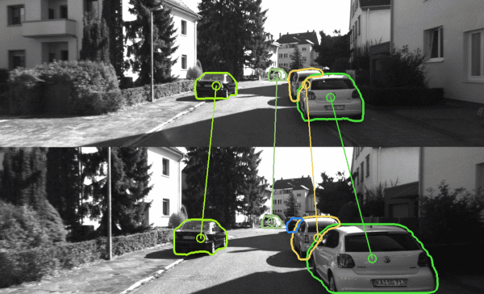

# AirCode

This repo contains source codes for the arXiv preprint ["AirCode: A Robust Object Encoding Method"](https://arxiv.org/abs/2105.00327)


## Demo
Object matching comparison when the objects are non-rigid and the view is changed, left is the result of our method while right is the result of NetVLAD

  

Relocalization on KITTI datasets




## Dependencies
* Python
* PyTorch
* OpenCV
* Matplotlib
* NumPy
* Yaml
  

## Data
Four datasets are used in our experiments.

### KITTI Odometry
For relocalization experiment. Three sequences are selected, and they are "00", "05" and "06".

### KITTI Tracking
For multi-object matching experiment. Four sequences are selected, and they are "0002", "0003", "0006", "0010".

### VOT Datasets
For single-object matching experiment. We select three sequences from VOT2019 datasets and they are "bluecar", "bus6" and "humans_corridor_occ_2_A", because the tracked objects in these sequences are included in coco datasets, which are the data we used to train mask-rcnn. 

### OTB Datasets
For single-object matching experiment. We select five sequences and they are "BlurBody", "BlurCar2", "Human2", "Human7" and "Liquor".


## Examples

### Relocalization on KITTI Datasets

1. Extract object descrptors
   ```
   python experiments/place_recogination/online_relocalization.py -c config/experiment_tracking.yaml -g 1 -s PATH_TO_SAVE_MIDDLE_RESULTS -d PATH_TO_DATASET -m PATH_TO_MODELS
   ```

2. Compute precision-recall curves
   ```
   python experiments/place_recogination/offline_process.py -c config/experiment_tracking.yaml -g 1 -d PATH_TO_DATASET -n PATH_TO_MIDDLE_RESULTS -s PATH_TO_SAVE_RESULTS
   ```

3. Compute top-K relocalization results
   ```
   python experiments/place_recogination/offline_topK.py -c config/experiment_tracking.yaml -g 1 -d PATH_TO_DATASET -n PATH_TO_MIDDLE_RESULTS -s PATH_TO_SAVE_RESULTS
   ```

### Object Matching on OTB, VOT or KITTI Tracking Datasets

* Run multi-object matching experiment in KITTI Tracking Datasets
  Modify the [config file](config/experiment_tracking.yaml) and run  
  ```
  python experiments/object_tracking/object_tracking.py -c config/experiment_tracking.yaml -g 1 -s PATH_TO_SAVE_RESULTS -d PATH_TO_DATASET -m PATH_TO_MODELS 
  ```

* Run single-object matching experiment in OTB or VOT Datasets
  Modify the [config file](config/experiment_tracking.yaml) and run  
  ```
  python experiments/object_tracking/single_object_tracking.py -c config/experiment_tracking.yaml -g 1 -s PATH_TO_SAVE_RESULTS -d PATH_TO_DATASET -m PATH_TO_MODELS 
  ```
